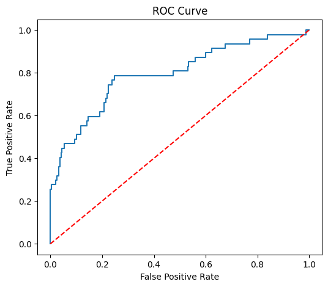
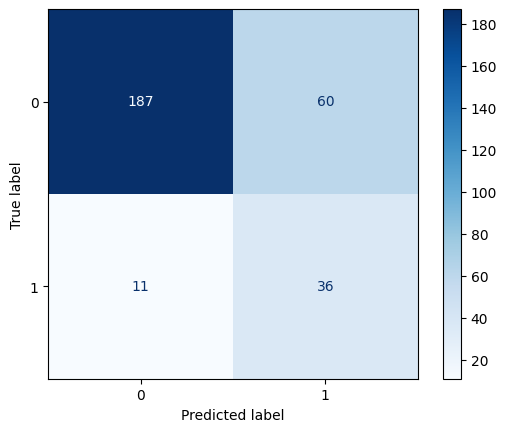
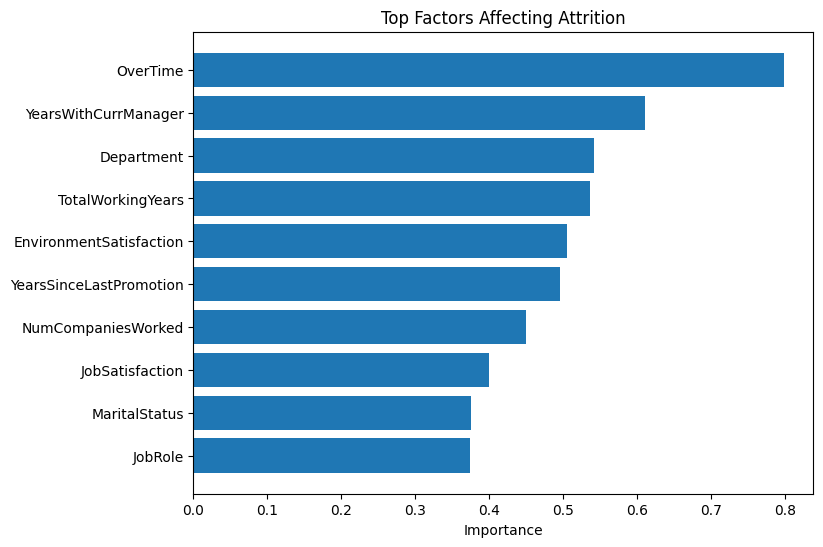

# Employee-Attrition-Prediction
Employee attrition prediction using machine learning with feature analysis and model evaluation.

## Project Overview
This project predicts employee attrition using machine learning techniques on the IBM HR Analytics dataset. The model identifies factors influencing employee turnover and provides insights through feature importance analysis.

---

## Dataset
IBM HR Analytics Employee Attrition Dataset

---

## Technologies Used
- Python
- Pandas
- NumPy
- Matplotlib
- Seaborn
- Scikit-Learn
- Jupyter Notebook

---

## Workflow
1. Data Cleaning
2. Exploratory Data Analysis
3. Feature Encoding
4. Train-Test Split
5. Model Training
6. Hyperparameter Tuning using GridSearchCV
7. Model Evaluation
8. Feature Importance Analysis

---

## Machine Learning Model
- Logistic Regression

---

## Evaluation Metrics
- Accuracy
- Precision
- Recall
- F1 Score
- ROC-AUC Score

---

## Results

### ROC Curve



### Confusion Matrix



### Feature Importance



---

## Repository Structure

```text
employee-attrition-prediction/
│
├── data/
├── images/
├── notebook/
├── .gitignore
├── LICENSE
├── README.md
└── requirements.txt
```

## Author

Gouri Sri Bolloju
